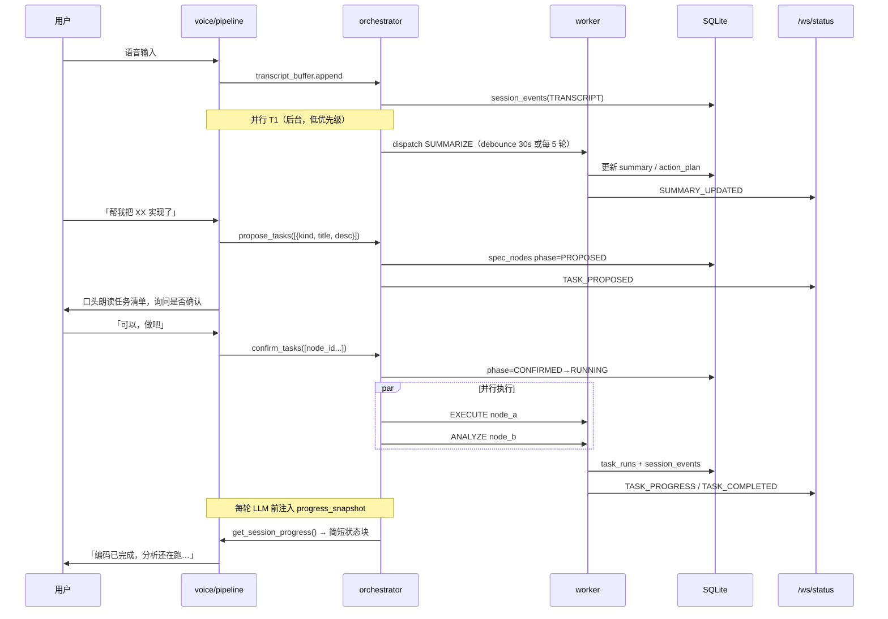

Callio (Call I/O) 工业级详细设计与系统实现规范 (LLM-Ready V1.0)

本规范为 Callio (通用自主声控 Agent 与自进化平台) 的工程级实现白皮书。旨在作为高阶代码生成 LLM（如 Claude Code, Cursor）的输入 Spec，以高解耦、高可用、极速响应、安全性为核心。

一、 系统总体架构设计 (System Architecture)

Callio 采用三层解耦架构：接入流控层 (Real-time Stream Engine)、业务逻辑与记忆中转层 (Core & Memory Hub) 以及 安全隔离异步执行层 (Sandboxed Worker)。

                    +---------------------------------------+
                    |           Client (多端接入)           |
                    |    (Flutter / H5 / WebRTC / Web)      |
                    +-------------------+-------------------+
                                        |
                 Audio (WebRTC)         |  State / Control (WebSocket / HTTP)
                                        v
+---------------------------------------+---------------------------------------+
| 1. 接入流控层 (Real-time Stream Engine)                                         |
|    - LiveKit Server (SFU)                                                     |
|    - Pipecat Gateway (STT/VAD -> Dialog LLM -> TTS)                           |
+---------------------------------------+---------------------------------------+
                                        | 异步派发 / Event Hub
                                        v
+---------------------------------------+---------------------------------------+
| 2. 核心与记忆层 (Core & Memory Hub)                                           |
|    - FastAPI HTTP / WebSocket Server (状态同步)                                |
|    - SQLite (工作/情景记忆) & ChromaDB (长期语义向量)                            |
|    - TaskIQ / Redis (任务分发队列)                                             |
+---------------------------------------+---------------------------------------+
                                        | 任务认领
                                        v
+---------------------------------------+---------------------------------------+
| 3. 安全执行层 (Sandboxed Worker)                                               |
|    - Docker Dev Sandboxes (项目开发沙箱)                                        |
|    - Claude Code / Hermes CLI Wrapper                                         |
|    - Shadow Build & Hot Swap Manager (自进化安全验证模块)                       |
+---------------------------------------+---------------------------------------+


核心解耦设计原则 (Decoupling Principles)：

语音与执行分离： 语音机器人（Pipecat）仅负责“听取脑暴、理清思路、标记要点”。一旦触发耗时的编码或测试任务，必须通过 TaskIQ 发送至 Redis 队列，严禁在语音 Session 线程中进行任何阻塞性操作（如编译、运行测试）。

状态共享源（Single Source of Truth）： 手机端看板、电脑端 API、以及 Pipecat 大脑看到的任务看板（Todo Table），均由本地 SQLite 数据库统一驱动，通过 SQLite Trigger 或 FastAPI Event Broker 实现毫秒级广播同步。

二、 架构规约与约束规范 (Architectural Constraints)

1. 通信规约

WebRTC 音频传输： 采用 LiveKit 协议。默认音频采样率 $16\text{ kHz}$，单声道，Opus 编码。

网络时延控制：

本地/局域网下，音频单向传输时延 $T_{\text{audio}} \le 150\text{ ms}$。

从用户说话结束（VAD 判定）到大语言模型开始输出语音，端到端延迟（STT + LLM First Token + TTS First Chunk） $T_{\text{response}} \le 800\text{ ms}$。

WebSocket 状态通道： 所有状态报文使用 JSON 格式。心跳间隔 $5\text{ s}$，重连最大尝试间隔 $10\text{ s}$。

2. 沙箱隔离规约

执行沙箱限制： 后端 Agent 执行代码编写和系统命令时，必须限制在专用的 Docker 容器中。

只读宿主： 宿主机代码项目目录以 -v /host/path/to/project:/workspace:rw 挂载。沙箱只能访问 /workspace，不允许拥有宿主机 / 根目录的写权限。

网络限制： 容器默认只允许访问受信任的 API 服务端口，防止其发起恶意 DDOS 攻击或外泄敏感凭证。

三、 模块详细设计与解耦 (Module Decoupling)

整个工程目录结构与模块解耦严格按照以下拓扑设计：

1. 项目目录树规约

callio/
├── config/                 # 全局配置模块
│   └── settings.py
├── core/                   # 核心与记忆中转服务
│   ├── database.py         # SQLite & Vector 数据库连接与初始化
│   ├── server.py           # FastAPI WebServer & WebSocket
│   └── memory.py           # 三层记忆机制（情景、工作、长期向量）
├── voice/                  # 接入流控层 (Pipecat)
│   ├── pipeline.py         # Pipecat 核心语音流动管理
│   ├── prompt.py           # 系统级双向对齐/脑暴 Prompt 模板
│   └── actions.py          # LLM 触发的 Function Calling 列表
├── worker/                 # 安全隔离异步执行层
│   ├── tasks.py            # TaskIQ/Celery 异步任务定义
│   ├── runner.py           # Claude Code/Hermes 调用包装器
│   └── sandbox.py          # Docker/E2B 容器管理
└── meta/                   # 自进化引擎
    ├── shadow_mgr.py       # 影子目录管理与蓝绿切换
    └── sanity_checker.py   # 自生自检、E2E连接验证


2. 模块 A：全双工语音管线 (voice/pipeline.py)

功能： 极低时延全双工语音桥接。

实现逻辑：

通过 livekit_client 接入 Room，初始化 Pipeline。

设置 SileroVAD：阈值设定为 $P_{\text{speech}} > 0.6$，静音判定时长 $500\text{ ms}$。

打断（Barge-In）中断控制流：

async def on_user_speech_start(transport, pipeline):
    # 1. 立即给 LiveKit 播发静音信令
    await transport.send_control_message({"action": "mute_tts"})
    # 2. 强行截断 TTS 缓冲队列
    pipeline.clear_buffers()
    # 3. 释放 LLM 的当前响应任务
    pipeline.cancel_current_task()


3. 模块 B：状态中心与多级记忆 (core/memory.py)

工作记忆 (Session)： 缓存在 Redis 中，记录最近 $10$ 次的未转录 Token。

情景记忆 (Episodic)： 挂断电话后触发，使用 SQLite 保存本次通话的 Markdown 结构化摘要及脑暴意图。

语义记忆 (Semantic)： 异步跑批，使用 ChromaDB 将历史待办及代码架构 AST 向量化：

$$\vec{V}_{\text{doc}} = \text{Embedding}(\text{AST\_Node\_Description})$$

SQLite 初始化 DDL 规约：

-- 会话表
CREATE TABLE IF NOT EXISTS sessions (
    session_id VARCHAR(36) PRIMARY KEY,
    title TEXT NOT NULL,
    transcript TEXT,
    summary TEXT,
    created_at TIMESTAMP DEFAULT CURRENT_TIMESTAMP
);

-- 任务看板表
CREATE TABLE IF NOT EXISTS spec_nodes (
    node_id VARCHAR(36) PRIMARY KEY,
    session_id VARCHAR(36) REFERENCES sessions(session_id),
    feature_name TEXT NOT NULL,
    description TEXT,
    difficulty_level INTEGER DEFAULT 1,
    status VARCHAR(20) DEFAULT 'DRAFT', -- DRAFT, PENDING, RUNNING, SUCCESS, FAILED, BLOCKED
    error_log TEXT,
    updated_at TIMESTAMP DEFAULT CURRENT_TIMESTAMP
);


4. 模块 C：沙箱任务执行器 (worker/runner.py)

核心逻辑：

监听 TaskIQ 派发的 EXECUTE_TODO 任务。

创建/重置开发沙箱（Docker）。

利用 Subprocess 流式捕获 claude code 输出，使用正则表达式匹配进程标准输出（Stdout），以持续提取执行进度百分比：

$$\text{Progress}_{\text{percent}} = \frac{N_{\text{passed\_tests}}}{N_{\text{total\_tests}}} \times 100\%$$

断点机制： Agent 在执行每一步前，必须生成 git diff 暂存。若报错，自动执行 git reset --hard 并返回上一级断点，重试次数阈值设定为 $3$ 次。

5. 模块 D：自进化引擎 (meta/shadow_mgr.py)

核心逻辑：

克隆自身库路径到 /callio/shadow。

在 shadow 目录下执行升级任务（调用 sandbox 在 shadow 目录跑 Claude Code 修改自身逻辑）。

自检度量模型 (Sanity Check)：
运行自检套件，计算 $\text{Sanity\_Score}$。公式定义为：

$$\text{Sanity\_Score} = \alpha \cdot \text{Api\_Test} + \beta \cdot \text{VAD\_Init} + \gamma \cdot \text{Database\_Migrate}$$

$$\text{其中，} \alpha = 0.3, \, \beta = 0.4, \, \gamma = 0.3, \quad \text{且必须满足 } \text{Sanity\_Score} = 1.0$$

热重载与蓝绿切换：
自检评分必须为 $1.0$。然后执行原子级软连接切换，并发送重启指令：

# 切换当前运行软链接
ln -sfn /callio/shadow /callio/active
# 热重启守护服务而不中断当前 LiveKit 通话 socket (利用 gunicorn HUP 信号)
kill -HUP $(cat /var/run/callio_api.pid)


四、 稳定性和性能保障设计 (Stability & Performance)

1. 弱网高容错

WebRTC 重连退避： 在客户端（App/H5）引入指数退避重连算法：

$$T_{\text{retry}} = \min(2^n \cdot 100\text{ ms}, \, 5000\text{ ms})$$

音频通道保持： 手机端接听后，强制声明 VoIP 后台音频模式。当 WebSocket 信令发生短时闪断时，保持音频流通道连接，在 $15\text{ s}$ 恢复窗口期内继续通话，避免由于网络颠簸导致挂机重播。

2. 代码自进化崩溃预防 (Watchdog Pattern)

为了防止 Callio 把自己改崩溃、从而导致用户彻底“断联”，主系统进程必须运行于进程守护（Supervisor/Systemd）下。

配置一个独立的、不被自进化代码修改的 Watchdog 进程：

Watchdog 每 $10\text{ s}$ 向本地 HTTP 端点 /api/v1/health 发送心跳检测。

如果心跳中断超过 $30\text{ s}$，Watchdog 强行重置软链接 /callio/active -> /callio/stable_backup，并在 $5\text{ s}$ 内强制杀死所有崩溃进程并冷启动恢复。

回滚成功后，Watchdog 绕过自进化代码直接向 LiveKit 音频服务端下发呼叫指令，呼唤用户：“主人，刚刚我尝试修改自己的语音管道逻辑失败并发生了严重崩溃，我已经成功完成了安全自我回滚，请查看刚才的异常日志。”

五、 初始化样板代码 (Boilerplate Implementation)

这部分代码是本系统启动的黄金代码。你可以将此代码直接喂给其他 LLM，作为它快速跑通 FastAPI + LiveKit + SQLite 框架的基础底座。

import os
import asyncio
from fastapi import FastAPI, WebSocket, WebSocketDisconnect
from pydantic import BaseModel
import sqlite3

app = FastAPI(title="Callio API Gateway", version="1.0")
DB_PATH = "callio_local.db"

# 初始化本地 SQLite 存储
def init_db():
    conn = sqlite3.connect(DB_PATH)
    cursor = conn.cursor()
    cursor.execute("""
    CREATE TABLE IF NOT EXISTS spec_nodes (
        node_id TEXT PRIMARY KEY,
        feature_name TEXT NOT NULL,
        description TEXT,
        status TEXT DEFAULT 'PENDING'
    )""")
    conn.commit()
    conn.close()

init_db()

class TodoItem(BaseModel):
    node_id: str
    feature_name: str
    description: str

class ConnectionManager:
    def __init__(self):
        self.active_connections: list[WebSocket] = []

    async def connect(self, websocket: WebSocket):
        await websocket.accept()
        self.active_connections.append(websocket)

    def disconnect(self, websocket: WebSocket):
        self.active_connections.remove(websocket)

    async def broadcast_status(self, message: dict):
        for connection in self.active_connections:
            await connection.send_json(message)

manager = ConnectionManager()

# WebSocket 毫秒级多端状态同步通道
@app.websocket("/ws/status")
async def websocket_endpoint(websocket: WebSocket):
    await manager.connect(websocket)
    try:
        while True:
            # 持续监听客户端指令或维持心跳
            data = await websocket.receive_text()
            await websocket.send_json({"status": "heartbeat", "received": data})
    except WebSocketDisconnect:
        manager.disconnect(websocket)

# 派发异步执行任务接口
@app.post("/api/v1/tasks/dispatch")
async def dispatch_task(todo: TodoItem):
    # 1. 写入本地 SQLite
    conn = sqlite3.connect(DB_PATH)
    cursor = conn.cursor()
    cursor.execute(
        "INSERT OR REPLACE INTO spec_nodes (node_id, feature_name, description, status) VALUES (?, ?, ?, ?)",
        (todo.node_id, todo.feature_name, todo.description, 'PENDING')
    )
    conn.commit()
    conn.close()

    # 2. 毫秒级广播状态至手机端 APP 看板
    await manager.broadcast_status({
        "event": "TASK_DISPATCHED",
        "node_id": todo.node_id,
        "feature_name": todo.feature_name,
        "status": "PENDING"
    })

    # 3. 异步唤醒 Sandbox Worker 运行 Claude Code (不阻塞当前 API 线程)
    asyncio.create_task(run_sandbox_worker(todo.node_id, todo.description))
    
    return {"status": "dispatched", "node_id": todo.node_id}

async def run_sandbox_worker(node_id: str, description: str):
    # 这里模拟沙箱后台多步骤执行
    await asyncio.sleep(5)  # 模拟慢长考
    # 更新 SQLite 为 RUNNING
    # 模拟执行成功，并通过 WebSocket 广播给多端
    await manager.broadcast_status({
        "event": "TASK_COMPLETED",
        "node_id": node_id,
        "status": "SUCCESS"
    })

---

## 附录 A：实现状态对照（更新至 V2 编排落地后）

| design.md 规约 | 实现状态 | 说明 |
|----------------|----------|------|
| 三层架构 + `orchestrator/` 编排层 | ✅ | voice ↔ orchestrator ↔ worker 已打通 |
| Pipecat 全双工语音（STT → LLM → TTS） | ✅ | WebSocket PCM；ChatTTS + say 回退 |
| Silero VAD + 打断 | ⚠️ 部分 | VAD 已接入；`on_user_speech_start` **未挂到 transport** |
| 通话中并行任务（提议/确认/监控） | ✅ | `propose_tasks` / `confirm_tasks` / `get_session_progress` |
| SQLite `sessions` + `spec_nodes` + 扩展表 | ✅ | `task_runs`、`session_events`、`kind`/`phase` |
| `/api/v1/tasks/dispatch` + `/ws/status` | ✅ | 语音与 HTTP 共用 `TaskDispatcher` |
| 转写持久化 + 挂断摘要 | ✅ | `transcript_buffer` + `finalize_summary` |
| Hermes/Claude EXECUTE | ⚠️ 部分 | 自动检测；**OpenClaw 未接入**；`CALLIO_AGENT_COMMAND` 不传 task |
| 手机端任务面板 | ⚠️ 部分 | 简易列表；无确认按钮 |
| TaskIQ / Redis 队列 | ❌ | `asyncio.create_task` |
| Docker 沙箱隔离 | ❌ | 桩代码 |
| 三层记忆（Redis/Chroma 深度接入） | ⚠️ 部分 | 进程内 deque；Chroma 可选 |
| 自进化 shadow / sanity / watchdog | ❌ | 脚手架未接入 |
| LiveKit / WebRTC / 弱网重连 | ❌ | H5 WebSocket |

**迭代计划详见 [docs/iteration-roadmap.md](docs/iteration-roadmap.md)。**

---

## 附录 B：V2 — 通话中并行任务编排架构

### B.1 目标能力（与用户期望对齐）

在**不中断电话式语音对话**的前提下，LLM 同时驱动三类后台能力：

| 编号 | 能力 | 触发时机 | 对用户可见行为 |
|------|------|----------|----------------|
| **T1 记录与规划** | 持续记录转写，周期性/按需生成摘要与行动计划 | 通话全程 + 每 N 轮对话 | 口头同步：「我记下了…，建议下一步…」 |
| **T2 执行工作** | 分析、编码、测试等耗时任务 | 用户明确同意后 | 口头同步派发内容，确认后后台执行 |
| **T3 进度监控** | 聚合所有任务状态与日志，供 LLM 掌握进度 | 任务运行中 + 每轮对话前 | 口头汇报：「编码任务已完成 2/3…」 |

核心原则（继承 V1 解耦）：

1. **语音线程永不阻塞** — 派发仅写库 + `asyncio.create_task`，禁止在 Pipecat pipeline 内 `await` 沙箱。
2. **先提议、后确认** — 任何 T2 执行类任务必须经过 `PROPOSED → CONFIRMED` 两阶段，由 LLM 向用户朗读确认。
3. **单一事实源** — SQLite + `session_events` 为任务与日志权威；`/ws/status` 与语音 LLM 上下文均从此读取。
4. **可并行、可取消** — 同一会话可有多条 `spec_nodes` 并行 RUNNING；用户插话可取消未确认提议。

### B.2 目录结构（新增 `orchestrator` 层）

在现有 `callio/` 上**增量**扩展，不推翻 V1 模块：

```
callio/
├── orchestrator/                 # 【新增】通话会话编排层（连接 voice ↔ core ↔ worker）
│   ├── __init__.py
│   ├── session_registry.py       # WebSocket 会话 ↔ session_id 绑定与生命周期
│   ├── transcript_buffer.py      # 实时转写追加、分段、持久化触发
│   ├── task_proposal.py          # 提议任务包（DRAFT spec_nodes + 待确认队列）
│   ├── task_coordinator.py       # 确认后并行 dispatch、取消、并发上限
│   ├── progress_snapshot.py      # T3：聚合任务状态 → LLM 可注入的简短上下文
│   └── event_bus.py              # 内存事件总线，桥接 DB 写入与 /ws/status 广播
│
├── voice/
│   ├── pipeline.py               # 注入 session_id、挂载新 tools、注册 barge-in
│   ├── prompt.py                 # 扩展：确认话术、进度汇报策略
│   ├── transcript_hook.py        # 【新增】TranscriptionFrame / TextFrame 采集
│   └── tools/                    # 【新增】按职责拆分的 Function Calling
│       ├── __init__.py
│       ├── memory_tools.py       # propose_summary / confirm_summary
│       ├── dispatch_tools.py     # propose_tasks / confirm_tasks / cancel_proposal
│       └── status_tools.py       # get_session_progress（只读快照）
│
├── core/
│   ├── database.py               # 扩展 DDL：task_runs、session_events、proposal 字段
│   ├── task_log.py               # 【新增】结构化执行日志追加
│   ├── session_events.py         # 【新增】会话事件 CRUD + 查询
│   └── broadcast.py              # 【新增】统一 status 消息 schema（可选，从 server 抽出）
│
├── worker/
│   ├── tasks.py                  # dispatch 增加 kind 路由
│   ├── kinds.py                  # 【新增】SUMMARIZE | ANALYZE | EXECUTE 枚举与 payload
│   └── runners/
│       ├── __init__.py
│       ├── base.py               # 流式 stdout 回调、进度事件
│       ├── summarize_runner.py   # T1：LLM 摘要（Ollama 子调用，轻量）
│       ├── analyze_runner.py     # T2：只读分析（grep/读文件/报告）
│       └── execute_runner.py     # T2：Hermes/claude 编码（复用现有 runner 逻辑）
│
└── web/static/
    └── index.html                # 可选：订阅 /ws/status 显示任务卡片（与语音确认互补）
```

**依赖方向（单向，避免环）：**

```
voice/tools  →  orchestrator  →  core (database, task_log)
                    ↓
              worker/tasks  →  worker/runners
                    ↓
              event_bus  →  /ws/status  +  progress_snapshot  →  voice LLM context
```

### B.3 数据模型扩展

在 V1 DDL 基础上追加：

```sql
-- 任务提议（确认前）
ALTER TABLE spec_nodes ADD COLUMN kind TEXT DEFAULT 'EXECUTE';
-- kind: SUMMARIZE | ANALYZE | EXECUTE
ALTER TABLE spec_nodes ADD COLUMN phase TEXT DEFAULT 'PROPOSED';
-- phase: PROPOSED | CONFIRMED | RUNNING | SUCCESS | FAILED | CANCELLED

-- 执行日志（T2/T1 过程记录，供 LLM 与用户追溯）
CREATE TABLE IF NOT EXISTS task_runs (
    run_id TEXT PRIMARY KEY,
    node_id TEXT NOT NULL REFERENCES spec_nodes(node_id),
    session_id TEXT NOT NULL,
    kind TEXT NOT NULL,
    status TEXT DEFAULT 'RUNNING',
    stdout_tail TEXT,          -- 最近 N KB 输出，供 LLM 摘要
    progress_pct INTEGER DEFAULT 0,
    started_at TIMESTAMP DEFAULT CURRENT_TIMESTAMP,
    finished_at TIMESTAMP
);

-- 会话事件流（转写片段、提议、确认、进度、完成）
CREATE TABLE IF NOT EXISTS session_events (
    event_id TEXT PRIMARY KEY,
    session_id TEXT NOT NULL,
    kind TEXT NOT NULL,
    -- TRANSCRIPT | SUMMARY_DRAFT | TASK_PROPOSED | TASK_CONFIRMED
    -- TASK_PROGRESS | TASK_COMPLETED | USER_ACK
    payload TEXT NOT NULL,     -- JSON
    created_at TIMESTAMP DEFAULT CURRENT_TIMESTAMP
);

-- 会话表补充：关联当前通话
ALTER TABLE sessions ADD COLUMN ended_at TIMESTAMP;
ALTER TABLE sessions ADD COLUMN action_plan TEXT;  -- 结构化行动计划 JSON/Markdown
```

### B.4 通话中事件流（时序）



### B.5 LLM 工具设计（voice/tools）

将现有单一 `execute_hermes_coding` **拆为提议-确认-查询**，避免误触发：

| 工具名 | 作用 | 是否阻塞语音 |
|--------|------|--------------|
| `propose_summary` | 根据当前转写生成摘要/行动草案，写入 DRAFT | 否（async dispatch SUMMARIZE） |
| `propose_tasks` | 创建 1～N 条 `PROPOSED` spec_nodes，返回待确认清单 | 否 |
| `confirm_tasks` | 用户口头确认后，将 node_id 列表置 CONFIRMED 并 dispatch | 否 |
| `cancel_proposal` | 取消未确认提议 | 否 |
| `get_session_progress` | 只读：返回 RUNNING/SUCCESS/FAILED 摘要（供 LLM 组织回复） | 否（读 DB 缓存快照） |

**Prompt 规约（`voice/prompt.py` 扩展）：**

- 派发前必须用一句话概括每个任务，并问「是否确认执行？」
- 未收到明确确认（「好」「可以」「开始」）时**禁止**调用 `confirm_tasks`
- 每 2～3 轮对话或用户询问进度时，先调用 `get_session_progress` 再回答
- 回复保持 ≤30 字，进度汇报优先口语化

### B.6 模块职责详解

#### `orchestrator/session_registry.py`

- WebSocket 连接建立时创建 `session_id`，写入 `sessions`
- 断开时触发 `finalize_session`：flush transcript、最后一次 SUMMARIZE、写 `ended_at`
- 提供 `get_session(websocket_id) -> SessionContext`

#### `orchestrator/transcript_buffer.py`

- 订阅 `TranscriptionFrame`（用户）与 `TextFrame`（助手）
- 内存缓冲 + 批量写入 `session_events(TRANSCRIPT)`
- debounce 触发 T1 `SUMMARIZE` 任务（避免每句都跑 LLM）

#### `orchestrator/task_proposal.py`

- `propose_tasks(session_id, items[])` → 生成 node_id，`phase=PROPOSED`
- 生成用户可朗读的 `preview_text` 返回给 LLM
- 维护 `pending_proposals[session_id]`

#### `orchestrator/task_coordinator.py`

- `confirm_tasks(session_id, node_ids[])` → 校验均属 PROPOSED → 转 RUNNING → 调用 `TaskDispatcher.dispatch`（并行）
- `max_parallel_per_session` 可配置（默认 3）
- 失败重试委托 `worker/runner` 现有逻辑

#### `orchestrator/progress_snapshot.py`

- 定时（5s）或事件驱动刷新缓存：`{running: 2, completed: 1, last_log: "..."}`
- `build_context_block(session_id) -> str` 注入 LLM system/context（≤500 字）
- 数据来源：`spec_nodes` + `task_runs` 最近 stdout_tail

#### `orchestrator/event_bus.py`

- 统一事件 schema：`{event, session_id, node_id, payload, ts}`
- 写 `session_events` + 调用 `status_manager.broadcast_status`
- voice WebSocket 可选第二通道订阅，或复用 `/ws/status`

#### `worker/kinds.py` + runners

| kind | Runner | 典型输入 | 输出 |
|------|--------|----------|------|
| `SUMMARIZE` | `summarize_runner` | transcript 全文 | `sessions.summary`, `action_plan` |
| `ANALYZE` | `analyze_runner` | 文件路径/问题描述 | Markdown 报告写入 `task_runs` |
| `EXECUTE` | `execute_runner` | Hermes task 文本 | 代码变更 + 测试进度 |

所有 runner 通过统一回调上报：

```python
async def on_progress(run_id: str, pct: int, line: str) -> None:
    task_log.append_stdout(run_id, line)
    event_bus.emit("TASK_PROGRESS", ...)
```

### B.7 与现有代码的衔接点

| 现有文件 | V2 改动 |
|----------|---------|
| `voice/pipeline.py` | 创建 `SessionRegistry`；注册 5 个新 tool；`WebSocketUIProcessor` 旁挂 `transcript_hook`；LLM context 注入 `progress_snapshot` |
| `voice/actions.py` | 迁移至 `voice/tools/*`，保留 re-export 兼容 |
| `worker/tasks.py` | `dispatch(payload)` 按 `kind` 路由到不同 runner |
| `worker/runner.py` | 逻辑迁入 `execute_runner.py`，原类变薄包装 |
| `core/server.py` | `app.state.orchestrator` 注入；dispatch API 可走同一 coordinator |
| `core/database.py` | 执行 B.3 迁移脚本 |

**删除/废弃：** 语音路径中 `execute_hermes_coding` 直接 `subprocess` 的 `pipeline.execute_hermes_coding`，改为 `task_coordinator.confirm_tasks` 统一入口。

### B.8 分阶段实施路线

| 阶段 | 交付物 | 用户可感知效果 |
|------|--------|----------------|
| **P0** | `session_registry` + `transcript_buffer` + 挂断摘要 | 通话有记录，结束后可查 session |
| **P1** | `propose_tasks` / `confirm_tasks` + `task_coordinator` 接通 worker | 口头确认后后台并行执行，不再直连 Hermes |
| **P2** | `progress_snapshot` + `get_session_progress` + prompt 更新 | 通话中可问「进展如何」，LLM 能答 |
| **P3** | `summarize_runner` 周期 T1 + `action_plan` | 自动沉淀行动计划 |
| **P4** | `index.html` 任务看板 + `/ws/status` | 手机端可视化任务卡（可选） |
| **P5** | TaskIQ/Redis、Docker sandbox | 对齐 V1 生产规约 |

### B.9 配置项（`config/settings.py` 拟新增）

| 变量 | 默认 | 说明 |
|------|------|------|
| `CALLIO_MAX_PARALLEL_TASKS` | `3` | 每会话最大并行 RUNNING 任务数 |
| `CALLIO_SUMMARIZE_DEBOUNCE_SEC` | `30` | T1 摘要触发间隔 |
| `CALLIO_PROGRESS_INJECT` | `1` | 是否在每轮 LLM 前注入进度块 |
| `CALLIO_REQUIRE_VERBAL_CONFIRM` | `1` | 是否强制 confirm_tasks 门禁 |

---

**V2 设计要点回顾：** 语音层只负责「听、说、提议、确认」；`orchestrator` 负责会话态与任务状态机；`worker` 负责真正执行；`core` 负责持久化与广播。三者通过 `event_bus` 与 `progress_snapshot` 让 LLM 在通话过程中**始终掌握后台并行任务的进度与结果**，且每次派发前**必须与用户口头同步并确认**。

---

## 附录 C：迭代优化路线图（V2.1 → V3）

完整分阶段计划、模块演进、验收标准见 **[docs/iteration-roadmap.md](docs/iteration-roadmap.md)**。

### 优先级速览

| Phase | 主题 | 核心价值 |
|-------|------|----------|
| **1** | Agent 打通（Hermes/OpenClaw/`{task}`） | 说「写代码」真能跑 agent |
| **2** | 通话体验（打断、动态进度、UI 确认） | 电话感 + 协作感 |
| **3** | 可靠性（队列、取消、日志 API） | 任务不丢、可追踪 |
| **4** | 记忆智能（跨通话、语义检索） | 记住项目上下文 |
| **5** | 安全生产（Docker、watchdog） | 可放心自动改代码 |
| **6** | 远期（LiveKit、自进化、原生 App） | 规模化 |

### 建议立即开工（本周）

1. `worker/agent_resolver.py` — OpenClaw + `CALLIO_AGENT_COMMAND="{task}"` 修复
2. `pipeline.py` 注册 barge-in 事件
3. 每轮转写后动态刷新 `progress_snapshot` 到 LLM context
